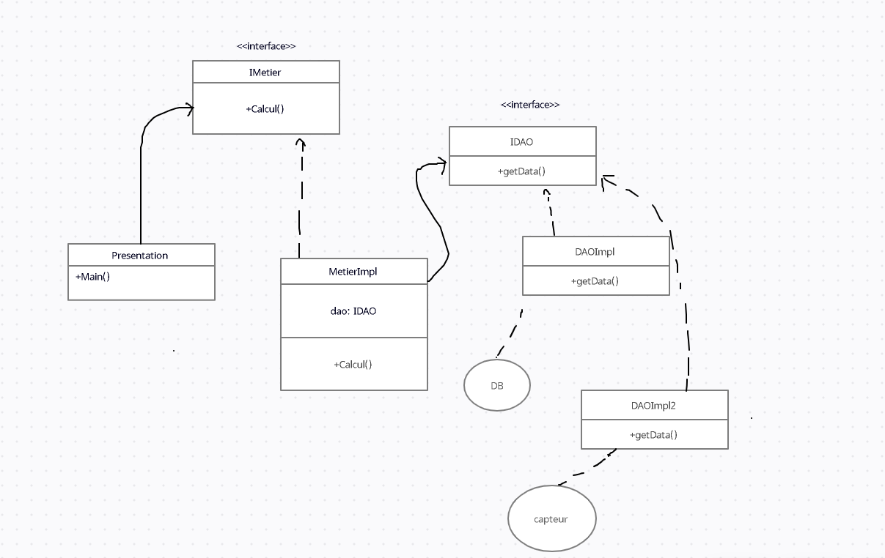
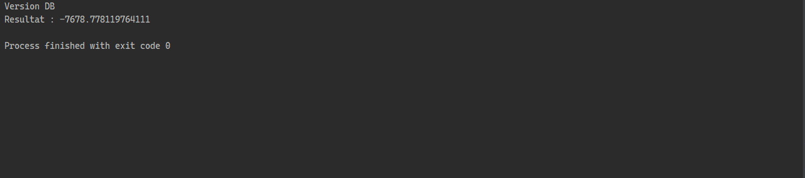
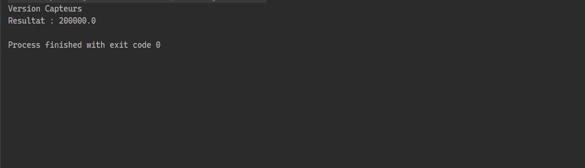
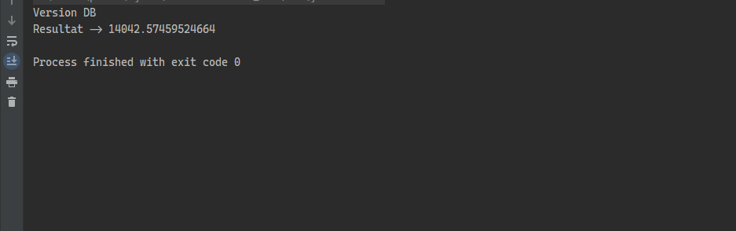
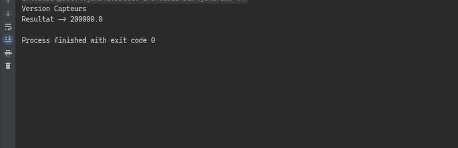

# 1.Introduction

La maintenance des applications ouvertes à la modification est très difficile, c'est pourquoi nous utilisons le concept d'applications ouvertes à l'extension et fermées aux modifications qui nous permet d'utiliser des interfaces pour implémenter différentes versions.
# 2.Enonce

1. Créer l'interface IDao
2. Créer une implémentation d'IDao
3. Créez l'interface IMetier
4. Créer une implémentation d'IMetier
5. Créez la couche Présentation en injectant les dépendances :
    1. By static instantiation

    2. By dynamic instantiation

    3. By using Spring Framework: XML and Annotation version

# 3.Conception

# 4.Source Code

[Source Code](https://github.com/youssefChergaoui/jee/tree/main/EMSI_ioc)

# 5.Screen Shots

## 1.Using Static instanciation:

database version :

sensors version :

## 2.Using Dynamic instanciation:

database version:

sensors version:

# 6.Conclusion

Dans ce travail, nous avons appliqué le concept d'application fermée aux midifications et ouverte à l'extension, et nous avons vu à quel point ce concept est bon. Nous avons également montré comment faire des instanciations statiques et dynamiques.